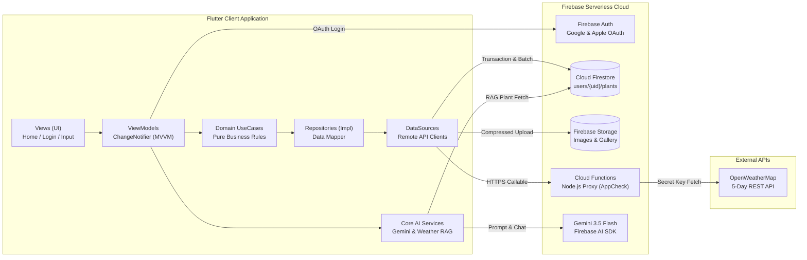
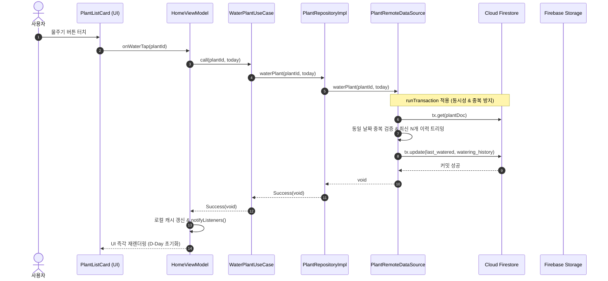
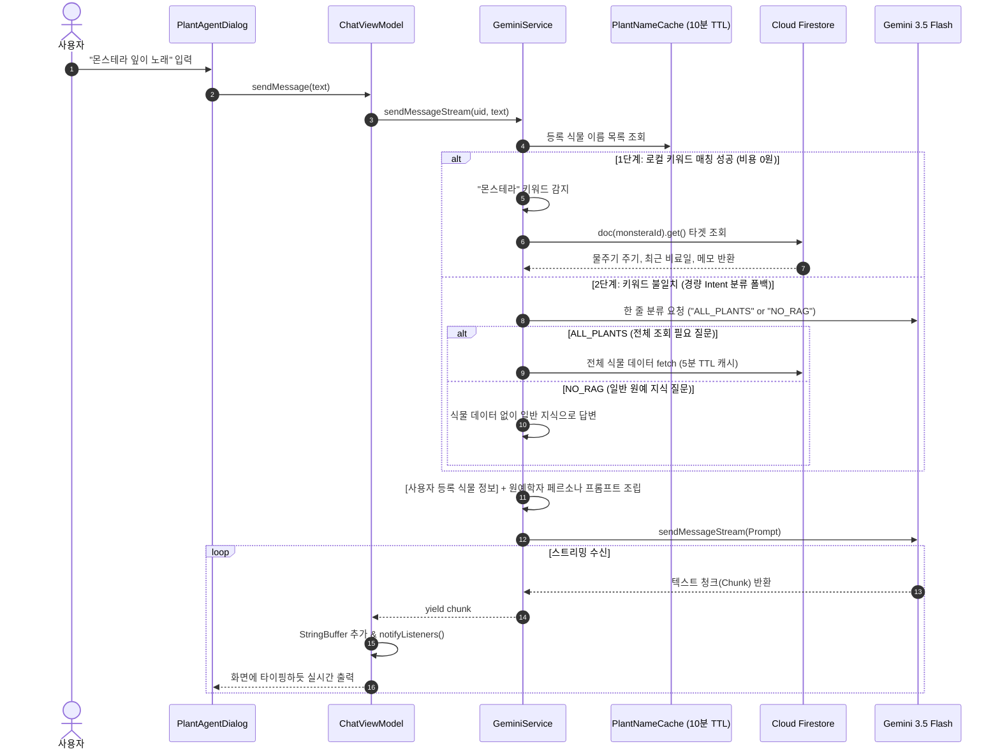
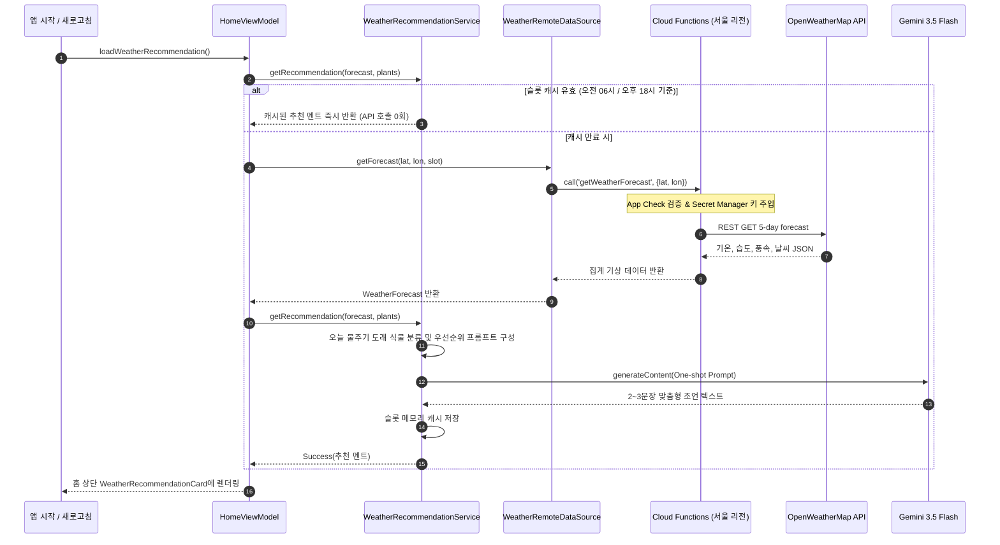

# Plant Management App - 파일 구조 및 데이터 흐름도

본 문서는 식물 관리 앱의 **Clean Architecture 기반 파일 구조**와 주요 기능별 **데이터 흐름(Data Flow)**을 정리한 문서입니다.
인터랙티브 탐색(다크/라이트 모드, 확대/축소, 단계별 뷰, PNG/SVG 내보내기)이 가능한 **Archify 독립형 HTML 다이어그램**도 함께 제공됩니다.

---

## 🎨 Archify 인터랙티브 다이어그램 결과물

프로젝트 내에 생성된 아래 HTML 파일을 브라우저(크롬, 엣지 등)로 열면 인터랙티브하게 확인하실 수 있습니다:

1. **시스템 아키텍처 다이어그램**: `project_root/docs/diagrams/plant_app_architecture.html`
2. **데이터 파이프라인 흐름도**: `project_root/docs/diagrams/plant_app_dataflow.html`

> **실행 팁**: VS Code / Cursor 탐색기에서 해당 `.html` 파일을 우클릭 후 **'Open with Live Server'** 또는 **'Reveal in File Explorer'**로 탐색기에서 더블 클릭하여 실행하시면 됩니다.

---

## 1. 프로젝트 파일 디렉토리 구조 (Clean Architecture)

프로젝트는 관심사 분리와 유지보수성, 테스트 용이성을 극대화하기 위해 **Clean Architecture (Presentation - Domain - Data - Core)** 4계층 패턴을 따르고 있습니다.

```text
lib/
 ┣ main.dart                           # 앱 엔트리포인트 (Firebase, App Check, ServiceLocator 초기화)
 ┣ firebase_options.dart               # 플랫폼별 Firebase 설정
 ┃
 ┣ presentation/                       # [1. Presentation Layer - UI 및 상태 관리]
 ┃ ┣ views/                            # 사용자 화면 페이지
 ┃ ┃ ┣ home_screen.dart                # 메인 홈 대시보드 (식물 카드 목록, 날씨 추천 카드)
 ┃ ┃ ┣ login_screen.dart               # 구글 및 애플 소셜 로그인 화면
 ┃ ┃ ┗ input_screen.dart               # 식물 추가/수정 입력 화면
 ┃ ┣ viewmodels/                       # MVVM 상태 관리 (ChangeNotifier)
 ┃ ┃ ┣ home_view_model.dart            # 식물 목록, 케어 액션, 날씨 카드, 회원 탈퇴 상태
 ┃ ┃ ┣ login_view_model.dart           # 소셜 로그인 세션 및 예외 처리 상태
 ┃ ┃ ┗ chat_view_model.dart            # AI 챗봇 메시지 목록 및 스트리밍 상태
 ┃ ┣ widgets/                          # 재사용 가능한 UI 컴포넌트
 ┃ ┃ ┣ plant_list_card.dart            # 식물별 D-Day 및 케어 버튼 카드
 ┃ ┃ ┣ weather_recommendation_card.dart# OWM + Gemini 결합 일일 케어 추천 배너
 ┃ ┃ ┣ care_button_sheet.dart          # 원터치 케어 기록 바텀시트
 ┃ ┃ ┣ plant_agent_dialog.dart         # Gemini RAG 챗봇 다이얼로그
 ┃ ┃ ┣ plant_gallery_dialog.dart       # 식물 성장 사진 타임라인 뷰어
 ┃ ┃ ┣ delete_account_dialog.dart      # 회원 탈퇴 재인증 다이얼로그
 ┃ ┃ ┗ app_sidebar.dart                # 환경설정, 테마, 오픈소스 라이선스 사이드바
 ┃ ┣ app_colors.dart                   # 앱 전역 컬러 팔레트
 ┃ ┗ app_theme.dart                    # 라이트/다크 테마 설정
 ┃
 ┣ domain/                             # [2. Domain Layer - 순수 비즈니스 로직 (외부 의존성 제로)]
 ┃ ┣ entities/                         # 핵심 비즈니스 도메인 모델 (Pure Dart Class)
 ┃ ┃ ┣ plant.dart                      # 식물 엔티티 (물주기, 카테고리, 최근 케어일)
 ┃ ┃ ┣ care_item.dart                  # 사용자 정의 케어 버튼 엔티티 (비료/농약)
 ┃ ┃ ┣ care_record.dart                # 케어 수행 이력 기록 엔티티
 ┃ ┃ ┣ gallery_photo.dart              # 성장 사진 엔티티
 ┃ ┃ ┣ weather_forecast.dart           # 기상 집계 데이터 엔티티
 ┃ ┃ ┗ chat_message.dart               # 챗봇 대화 메시지 엔티티
 ┃ ┣ repositories/                     # 데이터 접근 인터페이스 (Contract)
 ┃ ┃ ┣ plant_repository.dart
 ┃ ┃ ┣ care_item_repository.dart
 ┃ ┃ ┣ auth_repository.dart
 ┃ ┃ ┣ chat_repository.dart
 ┃ ┃ ┗ weather_repository.dart
 ┃ ┣ usecases/                         # 단일 책임 유스케이스
 ┃ ┃ ┣ get_plants_usecase.dart
 ┃ ┃ ┣ save_plant_usecase.dart
 ┃ ┃ ┣ delete_plant_usecase.dart
 ┃ ┃ ┣ water_plant_usecase.dart
 ┃ ┃ ┣ fertilize_plant_usecase.dart
 ┃ ┃ ┣ pesticide_plant_usecase.dart
 ┃ ┃ ┣ sign_in_with_google_usecase.dart
 ┃ ┃ ┣ sign_in_with_apple_usecase.dart
 ┃ ┃ ┣ delete_account_usecase.dart
 ┃ ┃ ┣ send_message_usecase.dart
 ┃ ┃ ┗ get_weather_recommendation_usecase.dart
 ┃ ┗ care_history_limits.dart          # 케어 이력 최대 보존 개수 정책 (트리밍)
 ┃
 ┣ data/                               # [3. Data Layer - 데이터 소스 및 영속성 구현]
 ┃ ┣ models/                           # DTO (Data Transfer Object, JSON/Firestore 직렬화)
 ┃ ┃ ┣ plant_dto.dart
 ┃ ┃ ┣ care_item_dto.dart
 ┃ ┃ ┣ care_record_dto.dart
 ┃ ┃ ┣ gallery_photo_dto.dart
 ┃ ┃ ┗ weather_forecast_dto.dart
 ┃ ┣ mappers/                          # DTO <-> Domain Entity 상호 변환기
 ┃ ┃ ┣ plant_mapper.dart
 ┃ ┃ ┣ care_item_mapper.dart
 ┃ ┃ ┣ care_record_mapper.dart
 ┃ ┃ ┗ gallery_photo_mapper.dart
 ┃ ┣ datasources/                      # 외부 서비스/클라우드 통신 원격 데이터 소스
 ┃ ┃ ┣ plant_remote_datasource.dart    # Firestore plants 및 gallery CRUD (Transaction, Batch)
 ┃ ┃ ┣ care_item_remote_datasource.dart# Firestore care_items 버튼 관리
 ┃ ┃ ┣ auth_remote_datasource.dart     # Google/Apple 로그인 및 토큰 발급/Revoke
 ┃ ┃ ┣ user_remote_datasource.dart     # 탈퇴 시 Storage 및 Firestore 연쇄 삭제
 ┃ ┃ ┣ weather_remote_datasource.dart  # Cloud Functions OWM 호출 (슬롯 캐시)
 ┃ ┃ ┗ gemini_datasource.dart          # Firebase AI 모델 통신
 ┃ ┗ repositories_impl/                # Domain Repository 인터페이스 구현체
 ┃   ┣ plant_repository_impl.dart
 ┃   ┣ care_item_repository_impl.dart
 ┃   ┣ auth_repository_impl.dart
 ┃   ┣ chat_repository_impl.dart
 ┃   ┗ weather_repository_impl.dart
 ┃
 ┗ core/                               # [4. Core Layer - 공통 인프라 & 서비스]
   ┣ di/
   ┃ ┗ service_locator.dart            # 앱 전역 의존성 수동 주입 (Singleton Locator)
   ┣ result/
   ┃ ┗ result.dart                     # 함수 성공(Success)/실패(Failure) 패턴
   ┗ services/
     ┣ gemini_service.dart             # 2단계 동적 RAG, 페르소나 설정, 스트리밍 세션
     ┣ weather_recommendation_service.dart # 날씨 + 식물 결합 원샷 조언 생성기
     ┣ notification_service.dart       # 로컬 물주기 푸시 알림
     ┗ app_version.dart                # 앱 버전 정보
```

---

## 2. 시스템 아키텍처 다이어그램

아래 다이어그램은 프런트엔드 Clean Architecture 레이어와 백엔드 Firebase 생태계 간의 의존성 구조를 나타냅니다.



---

## 3. 핵심 기능별 데이터 흐름도 (Data Flow)

### 3.1 식물 케어 액션 및 등록/삭제 (CRUD) 데이터 흐름
사용자가 물주기 버튼을 탭하거나 식물을 등록/삭제할 때의 동시성 제어 및 영속화 흐름입니다.



**기술적 특징**:
- **트랜잭션(`runTransaction`)**: 버튼 연타로 인한 동일 날짜 중복 저장을 데이터베이스 레벨에서 원자적(Atomic)으로 차단합니다.
- **연쇄 일괄 삭제(`WriteBatch`)**: 식물 삭제 시 Storage의 사진 파일 삭제와 Firestore의 하위 `gallery` 서브컬렉션을 배치로 묶어 잔여 고립 데이터(Orphan data)를 원천 방지합니다.

---

### 3.2 AI 챗봇 2단계 동적 RAG 데이터 흐름
비용과 응답 지연시간을 최소화하기 위한 선택적 프롬프트 증강(RAG) 파이프라인입니다.



**기술적 특징**:
- **비용 0원 로컬 매칭**: 질문 내 식물 이름을 1차 탐색하여 매칭된 단일 식물만 핀포인트 조회하므로 DB 읽기 비용과 LLM 토큰 낭비를 차단합니다.
- **스트리밍(`sendMessageStream`)**: 첫 글자가 생성되는 즉시 화면에 출력되어 사용자의 체감 응답 대기 시간을 대폭 줄였습니다.

---

### 3.3 날씨 연동 & AI 맞춤형 케어 추천 카드 흐름
실시간 기상 데이터와 식물 물주기 상태를 결합하여 추천 카드를 생성하는 흐름입니다.



**기술적 특징**:
- **보안 프록시**: OWM API Key가 모바일 앱에 노출되지 않도록 Cloud Functions와 Secret Manager를 통해 은닉하고, `App Check`로 비인가 호출을 차단합니다.
- **시간대 슬롯 캐싱**: 오전(06:00, 오늘 날씨)과 오후(18:00, 내일 날씨) 슬롯 단위로 결과를 캐싱하여 과도한 외부 API 비용 발생을 방지합니다.
